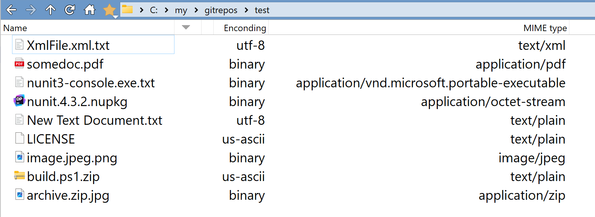

# DirectoryOpus-FileMimeTypeAndEncodingColumns-plugin
This plugin adds two columns, "MIME type" and "Encoding" using [UNIX file](https://man7.org/linux/man-pages/man1/file.1.html) utility. 
The plugin uses the content of a file and not its extension. 
The screenshot below shows how the encoding and MIME type are correctly determined, even for files with incorrect extensions.

# Prerequisites
You need to have `file.exe` utility installed on your system. The easiest way to get it is to install [Git for Windows](https://git-scm.com/downloads/win)

# Limitations
* The script has to call `file.exe` for each file in the folder. Thus, it might be very slow for big folders.
* UNC paths (paths that start with `\\`) and FTP paths are not supported - the MIME type column will be empty

# How to use
* Make sure `file.exe` is installed on your system
* Download the `js` file from the [latest release](https://github.com/PolarGoose/DirectoryOpus-FileMimeTypeColumn-plugin/releases)
* Copy the `js` file to the `%AppData%\GPSoftware\Directory Opus\Script AddIns` folder
* The extra columns will become available in the `Settings`->`File Display Columns`->`Appearance`->`Columns:`.
* By default, the script uses the `%ProgramFiles%/Git/usr/bin/file.exe` path. If it is installed in a different folder, you need to change the script configuration in the `Script management` menu.
